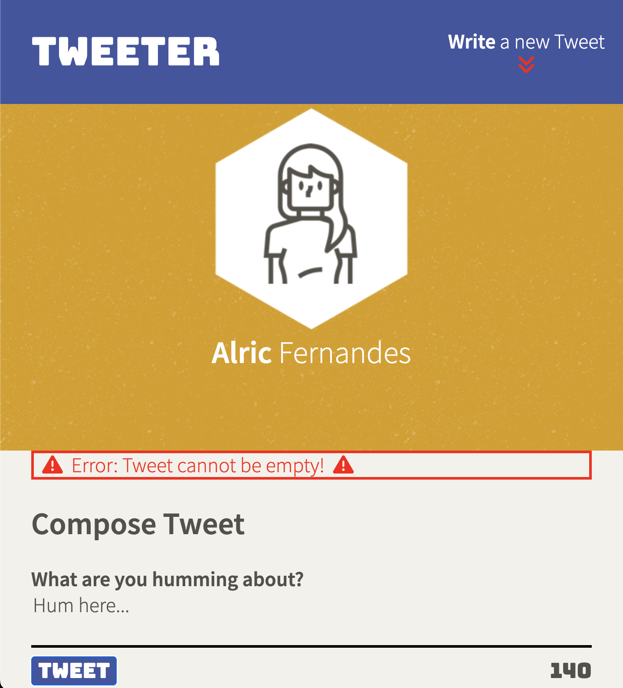

# Tweeter Project

Tweeter is a simple, single-page Twitter clone.

This repository uses a pre-built back-end along with starter code for the project which can be found in the [template repository](https://github.com/lighthouse-labs/tweeter). The template repository has been forked and cloned into this repository and then built upon using HTML, CSS, JS, jQuery and AJAX front-end skills along with Node and Express back-end skills.

The original design is for mobile (width: below 768px). There are responsive designs for the application on tablet (width: 768px to 1023px) and desktop (width: 1024px and above) using media queries. Kindly, change the screen width to see the appropriate design.

There is error handling for empty tweet and over maximum characters of 140 tweet submissions; with a slide up and down error message. The tweet counter changes based on the count of characters and becomes negative and red after 140 characters are inputed.

## Final Product - Screenshots (Mobile Design)

- Default Page Landing

- New Tweet Box

- Tweet Box

- Latest Tweet Order

- Error Handling (Empty Tweet Submission Example)

## Getting Started

1. [Create](https://docs.github.com/en/repositories/creating-and-managing-repositories/creating-a-repository-from-a-template) a new repository using this repository as a template.
2. Clone your repository onto your local device.
3. Install dependencies using the `npm install` command.
3. Start the web server using the `npm run local` command. The app will be served at <http://localhost:8080/>.
4. Go to <http://localhost:8080/> in your browser.

## Dependencies

- Body-Parser
- Chance
- Express
- Nodemon
- Node 5.10.x or above
